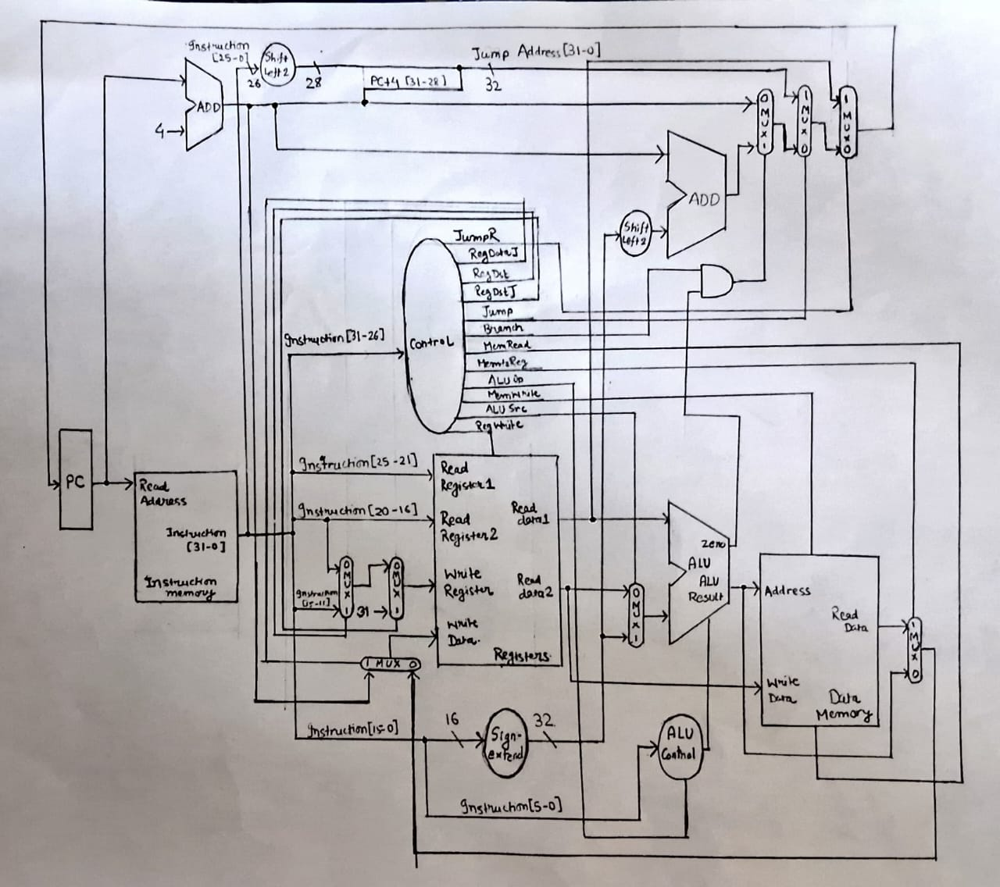

# Gate-Level Single Cycle MIPS Processor

## 📘 Project Overview

This project implements a **Single Cycle MIPS Processor** using **gate-level Verilog HDL**. Each instruction completes in a single clock cycle, closely emulating the classic MIPS architecture. Developed as course assignment **CS224 Hardware Lab – 2025** and **CS223 Computer Architecture and Organization**, this processor helps in understanding how MIPS works at the logic gate level.

> ⚙️ **Gate-level modeling**: All components are constructed using primitive gates and simple modules — no high-level abstractions are used.

---

## 🧠 Supported Instructions

| **Type** | **Instructions**                            | **Description**                                 |
|----------|---------------------------------------------|-------------------------------------------------|
| R-Type   | `add`, `sub`, `and`, `or`, `slt`, `jr`      | Register-based arithmetic and control           |
| I-Type   | `lw`, `sw`, `addi`, `beq`                   | Immediate, memory access, and branching         |
| J-Type   | `j`, `jal`                                  | Jump and subroutine support                     |

---

## 🔩 Components

- **Program Counter (PC)** – Stores address of the current instruction
- **Instruction Memory** – Stores machine code
- **Register File** – 32 general-purpose 32-bit registers
- **ALU (Arithmetic Logic Unit)** – Performs logical and arithmetic ops
- **Control Unit** – Decodes opcodes and generates control signals
- **Data Memory** – For `lw` and `sw` operations
- **Sign Extension Unit** – Extends 16-bit immediates to 32-bit
- **Multiplexers** – Data routing based on control logic
- **ALU Control** – Derives ALU operations from opcode + funct fields

---

## 🧮 Register Naming Conventions

| Register | Name  | Usage                            |
|----------|-------|----------------------------------|
| `$zero`  | R0    | Always 0                         |
| `$t0`–`$t7` | R8–R15 | Temporaries                   |
| `$s0`–`$s7` | R16–R23 | Saved registers              |
| `$ra`    | R31   | Return address (`jal`, `jr`)     |

---

## 🔄 Control Signals Summary

| Control Signal | Description                        |
|----------------|------------------------------------|
| `RegDst`       | Select destination register        |
| `Jump`         | Used for `j`, `jal`                |
| `MemRead`      | Enable memory read (`lw`)          |
| `MemtoReg`     | Choose between ALU and memory      |
| `ALUOp`        | Encodes ALU operation              |
| `MemWrite`     | Enable memory write (`sw`)         |
| `ALUSrc`       | Choose between reg or immediate    |
| `RegWrite`     | Enable writing to register file    |

---

## 📐 DataPath



## 🧪 Simulation and Usage

### ✅ Running the Simulation

Use **Icarus Verilog** (or any Verilog simulator):

```bash
iverilog -o ./results/mips_sim *.v ./common/*.v
vvp ./results/mips_sim > ./results/output.txt
```

### ✍️ Writing & Loading Instructions

Instructions are listed in the `instructions.txt` file in hexadecimal format. For example:

```
20080005
2009000A
01095020
AC0A0000
8C0B0000
114B0001
00006020
0C000009
0800000B
214C000A
07E00000
FC000000
```

These correspond to:

```assembly
main:
    addi $t0, $zero, 5
    addi $t1, $zero, 10
    add  $t2, $t0, $t1
    sw   $t2, 0($zero)
    lw   $t3, 0($zero)
    beq  $t2, $t3, skip
    add  $t4, $zero, $zero

skip:
    jal func
    j   end

func:
    addi $t4, $t2, 10
    jr   $ra

end:
    halt
```
---

## 🙏 Acknowledgments

- CS224 Hardware Lab Faculty and TAs
- CS223 Computer Architecture and Organization Faculty and TAs
- Patterson & Hennessy – *Computer Organization and Design*